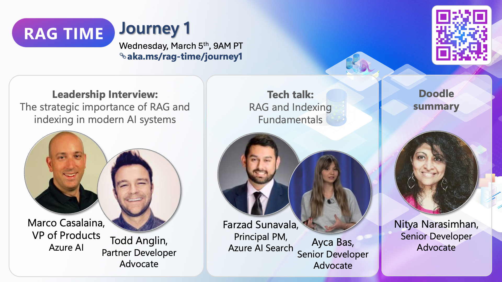

# Journey 1: RAG and Indexing Fundamentals

## Overview

Welcome to **Journey 1: RAG & Indexing Fundamentals**. This space is designed to help you understand how retrieval and indexing work together to enhance AI-generated responses.

In this journey, we explore how indexing makes retrieval possible, why it’s essential for scalable, real-time AI interactions, and how Azure AI Search enables intelligent data access. You'll learn how search indexing, vector embeddings help AI retrieve information before generating responses.

**📅 March 5th, 9AM PT | 📺 [Watch the session](https://aka.ms/rag-time/journey1)**

## 🎥 Session Summary

### 🎥 AI & RAG: The Big Picture

AI models are powerful, but without real-time knowledge retrieval, their responses can be outdated or generic. RAG bridges this gap by dynamically pulling relevant information before generating text, ensuring that AI remains accurate and adaptable. But for retrieval to be efficient, data must be properly indexed. A well-structured index enables AI to find and apply knowledge instantly, reducing search time and improving response quality.

### 📚 Making AI Smarter: The Role of Indexing

Indexing is the backbone of AI retrieval. Without it, AI systems would struggle to locate relevant data quickly. Keyword indexing provides structured search, while vector indexing enables AI to understand meaning beyond exact word matches. Hybrid approaches combine both for maximum accuracy. Azure AI Search helps developers create scalable search solutions that integrate these methods, making AI-powered applications faster and more reliable.

### 🖍 Doodle Summary

A visual summary of key takeaways is available to reinforce learning.

## 📂 Sample Code

To get hands-on experience, explore the sample implementation in the 📂 [Journey 1 Sample](./sample/) folder.

## 🔗 Additional Learning Resources

- 📖 Blog post
- 📚 Azure AI Search Documentation: [Learn more](https://learn.microsoft.com/en-us/azure/search/)

💬 Join the Discussion: Connect with the community in GitHub Discussions or open an issue in this repository.

🚀 Next Up: Continue to [Journey 2](./../Journey%202%20-%20Build%20the%20Ultimate%20Retrieval%20System%20for%20RAG/) for the next step—Building the Ultimate Retrieval System!