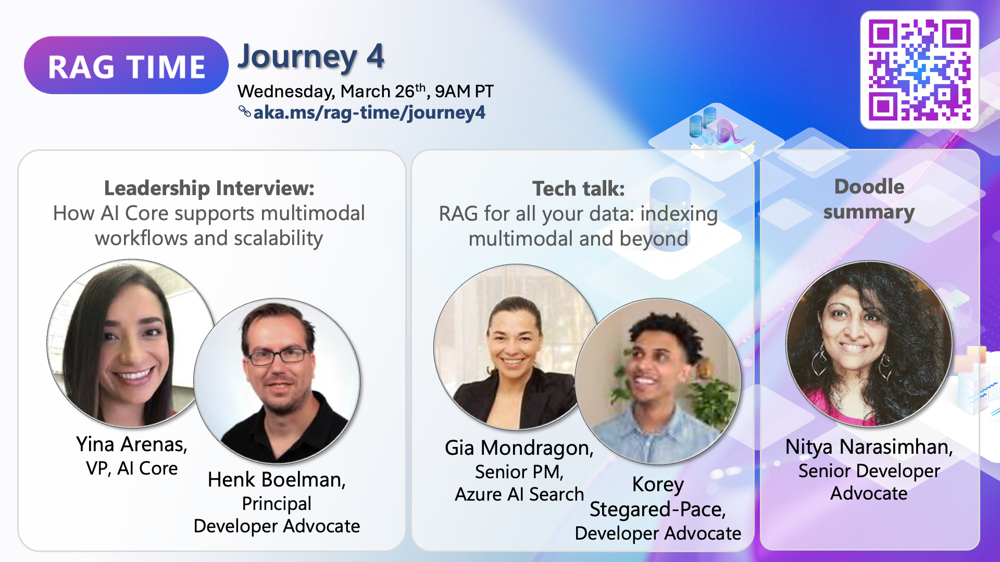
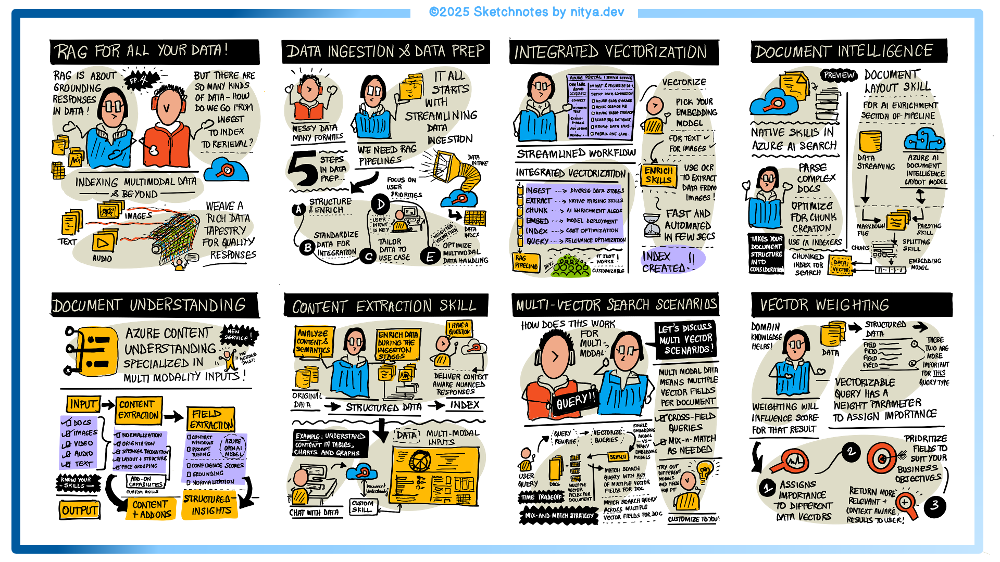

# Journey 4: RAG for All Your Data – Multimodal and Beyond

## Overview

Welcome to **Journey 4: RAG for All Your Data – Multimodal and Beyond**. This space is designed to help you understand how multimodal retrieval enhances AI applications by enabling the integration of text, images, audio, and video into AI workflows.

In this journey, we explore the importance of multimodal indexing, how Azure AI Foundry simplifies development, and strategies to scale multimodal RAG solutions efficiently. You’ll learn how integrated vectorization, Azure Document Intelligence, and content understanding improve retrieval accuracy and how query techniques like multi-vector search and vector weighting optimize responses.

**📅 March 26th, 9AM PT | 📺 [Watch the session](https://aka.ms/rag-time/journey4)**

## 🎥 Session Summary

### 🎥 The Power of Multimodal RAG

AI applications today must process more than just text—images, voice, and documents all play a role in delivering richer, more intuitive interactions. Multimodal workflows allow AI to match queries to multiple types of content, improving relevance and user experience. With advancements in GPT-4o real-time and Azure AI Foundry, developers can seamlessly integrate multimodal models into their applications, creating AI systems that understand and respond across various data types.

### 📚 Indexing and Retrieval for Multimodal Data

Indexing multimodal data ensures AI can retrieve the right information, regardless of format. Data ingestion and preparation help structure content for efficient search. Integrated vectorization converts different data types into a unified format, making it easier to search across text, images, and voice. Azure Document Intelligence and Content Understanding further enhance retrieval by extracting insights and analyzing semantics from unstructured data.

Advanced query techniques like multi-vector search, cross-field vector search, and vector weighting refine results, ensuring AI surfaces the most relevant information for each query. These strategies help developers optimize RAG workflows for accuracy, scalability, and speed.

### 🖍 Doodle Summary

A visual summary of key takeaways is available to reinforce learning.

## 📂 Sample Code

To get hands-on experience, explore the sample implementation in the 📂 [Journey 4 Sample](./sample/) folder.

## 🔗 Additional Learning Resources

- 📖 Blog post
- 📚 Azure AI Search Documentation: [Learn more](https://learn.microsoft.com/en-us/azure/search/)

💬 Join the Discussion: Connect with the community in GitHub Discussions or open an issue in this repository.

🚀 Next Up: Continue to [Journey 5](./../Journey%205%20-%20Hero%20use%20cases%20for%20RAG/) for the next step—best practices and use cases for RAG!