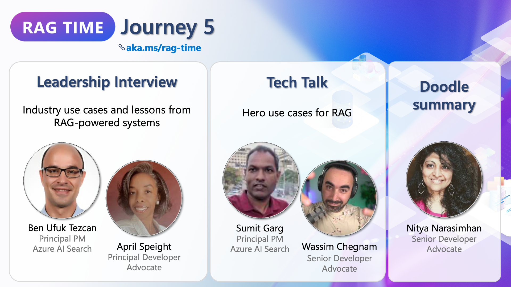
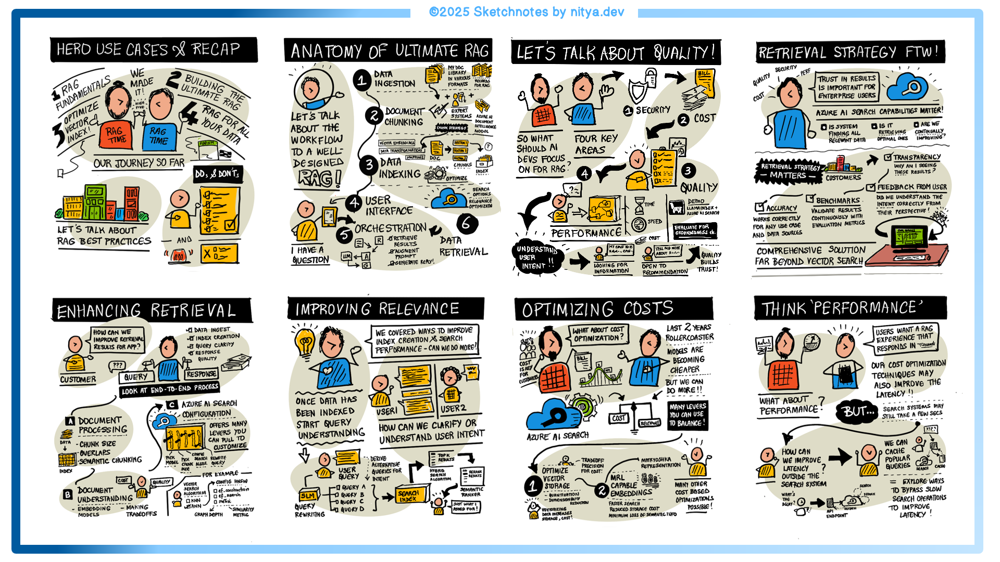

# Journey 5: Hero Use Cases for RAG

## Overview

Welcome to Journey 5: Hero Use Cases for RAG. This space is designed to help you understand how RAG-powered AI systems are transforming industries, optimizing search experiences, and driving Responsible AI practices.

In this journey, we explore real-world industry use cases, key lessons from deploying RAG, common pitfalls to avoid, and the importance of Responsible AI. You’ll also gain insights into optimizing retrieval strategies, enhancing performance, and managing costs when building AI-powered search applications.

**📅 April 2nd, 9AM PT | 📺 [Watch the session](https://aka.ms/rag-time/journey5)**

## 🎥 Session Summary

### 🔍 RAG in the Real World: Industry Use Cases

RAG is revolutionizing industries by unifying fragmented data, providing context-rich responses, and addressing domain-specific challenges. From legal document retrieval to customer support automation, RAG-powered solutions are enabling businesses to make AI-powered decisions faster and more efficiently.

### 📚 Best Practices and Lessons from Deploying RAG

Building a high-performing RAG system requires iteration and refinement. Starting small, leveraging open-source tools, and focusing on business problems rather than technology-first approaches can significantly improve outcomes. This session highlights key takeaways, including strategies to reduce hallucinations, maintain AI quality, and continuously measure system performance.

### ⚖ Responsible AI in RAG Workflows

Ensuring fairness, transparency, and accountability in AI workflows is crucial. Responsible AI practices help mitigate risks like bias, hallucinations, and trust concerns. By implementing risk and safety evaluations, content filtering, and continuous monitoring, developers can build trustworthy, reliable AI systems that evolve over time.

### 🖍 Doodle Summary

A visual summary of key takeaways is available to reinforce learning.

## 📂 Sample Code

To get hands-on experience, explore the sample implementation in the 📂 [Journey 5](./sample/) Sample folder.

## 🔗 Additional Learning Resources

- 📖 Blog post
📚 Azure AI Search Documentation: [Learn more](https://learn.microsoft.com/en-us/azure/search/)

💬 Join the Discussion: What’s your hero use case for RAG? Have you explored real-time AI-powered retrieval in your projects? Share your thoughts in GitHub Discussions, or open an issue in this repository. Let’s exchange ideas and push the boundaries of AI-powered search together! 🚀