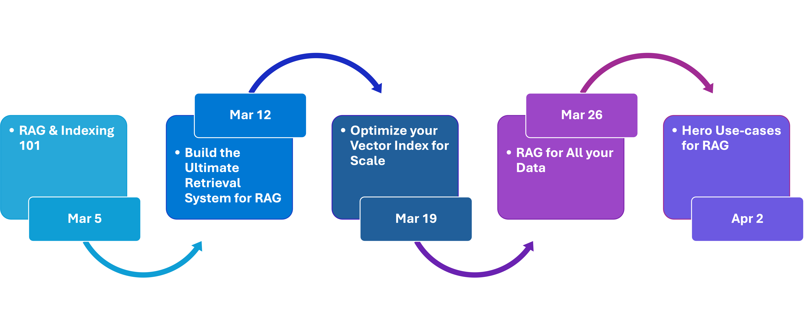

# RAG Time: AI Learning Series


🎉 Welcome to **RAG Time**, a 5-week AI learning series where **Retrieval-Augmented Generation (RAG)** meets innovation! This repository is your companion to the v**ideo series, containing code samples, step-by-step guides,** and **resources** to help you master RAG concepts.

## Overview

**Retrieval-Augmented Generation (RAG)** is a cutting-edge technique combining **search** and **generative AI** to deliver highly relevant and dynamic outputs. With RAG, you can enhance your AI systems by connecting them to vast data sources, making retrieval efficient and generation accurate.

The RAG Time series aims to:

- Teach foundational and advanced RAG concepts.
- Demonstrate how RAG can be applied to real-world scenarios.
- Provide hands-on samples for practical implementation.
- Whether you're a developer, data scientist, or AI enthusiast, this series will guide you through the exciting world of RAG.

## Agenda: Weekly Journeys

RAG Time runs every **Wednesday at 9AM PT** from **March 5th to April 2nd**. Each journey covers unique topics with leadership insights, tech talks, and code samples.



- **📅 March 5th, 9AM PT | 📺 [Watch Journey 1](https://aka.ms/rag-time/journey1) | 📂 [Resources](./Journey%201%20-%20RAG%20and%20Indexing%20Fundamentals/README.md):** Understand the strategic importance of RAG and indexing fundamentals through expert insights and technical deep dives, wrapped up with a doodle summary.
- **📅 March 12th, 9AM PT | 📺 [Watch Journey 2](https://aka.ms/rag-time/journey2) | 📂 [Resources](./Journey%202%20-%20Build%20the%20Ultimate%20Retrieval%20System%20for%20RAG/README.md):** Explore how Azure AI Search powers retrieval systems with leadership perspectives and hands-on implementation, concluding with a doodle summary.
- **📅 March 19th, 9AM PT | 📺 [Watch Journey 3](https://aka.ms/rag-time/journey3) | 📂 [Resources](./Journey%203%20-%20Optimize%20your%20Vector%20Index%20for%20Scale/README.md):** Learn real-world optimization techniques for scaling vector indexes, featuring expert interviews and technical demonstrations, summarized with a doodle summary.
- **📅 March 26th, 9AM PT | 📺 [Watch Journey 4](https://aka.ms/rag-time/journey4) | 📂 [Resources](./Journey%204%20-%20RAG%20for%20All%20your%20Data%20Multimodal%20and%20Beyond/README.md):** Discover how multimodal data can be indexed and retrieved using RAG, with leadership discussions and practical applications, finalized with a doodle summary.
- **📅 April 2nd, 9AM PT | 📺 [Watch Journey 5](https://aka.ms/rag-time/journey5) | 📂 [Resources](./Journey%205%20-%20Hero%20use%20cases%20for%20RAG/README.md):** Get inspired by hero use cases of RAG in action, with leadership takeaways and deep technical insights, all captured in a doodle summary.

## How to use this repository

This repository is structured to align with the **5-week RAG Time series**.

1. Clone this repository:

```bash
git clone https://github.com/your-org/rag-time.git
cd rag-time
```

2. Navigate to a journey folder to explore topics and sample code.

```bash
cd Journey 1 - RAG and Indexing Fundamentals
```

3. Follow the Journey README Instructions. Each journey contains:
- ✅ README.md with topic breakdowns
- ✅ Sample Code to explore RAG concepts
- ✅ Setup Instructions to run the demos

## Get Involved!

🚀 Let’s build the future of AI together!

- 💬 **Join the Community:** Discuss, ask questions, and share insights via GitHub Discussions.
- ⭐ **Star this repository** to stay updated.
- 📢 **Spread the word:** Share RAG Time with your network!

## Meet the RAG Time Speakers


## Contributing

This project welcomes contributions and suggestions.  Most contributions require you to agree to a
Contributor License Agreement (CLA) declaring that you have the right to, and actually do, grant us
the rights to use your contribution. For details, visit https://cla.opensource.microsoft.com.

When you submit a pull request, a CLA bot will automatically determine whether you need to provide
a CLA and decorate the PR appropriately (e.g., status check, comment). Simply follow the instructions
provided by the bot. You will only need to do this once across all repos using our CLA.

This project has adopted the [Microsoft Open Source Code of Conduct](https://opensource.microsoft.com/codeofconduct/).
For more information see the [Code of Conduct FAQ](https://opensource.microsoft.com/codeofconduct/faq/) or
contact [opencode@microsoft.com](mailto:opencode@microsoft.com) with any additional questions or comments.

## Trademarks

This project may contain trademarks or logos for projects, products, or services. Authorized use of Microsoft 
trademarks or logos is subject to and must follow 
[Microsoft's Trademark & Brand Guidelines](https://www.microsoft.com/en-us/legal/intellectualproperty/trademarks/usage/general).
Use of Microsoft trademarks or logos in modified versions of this project must not cause confusion or imply Microsoft sponsorship.
Any use of third-party trademarks or logos are subject to those third-party's policies.
